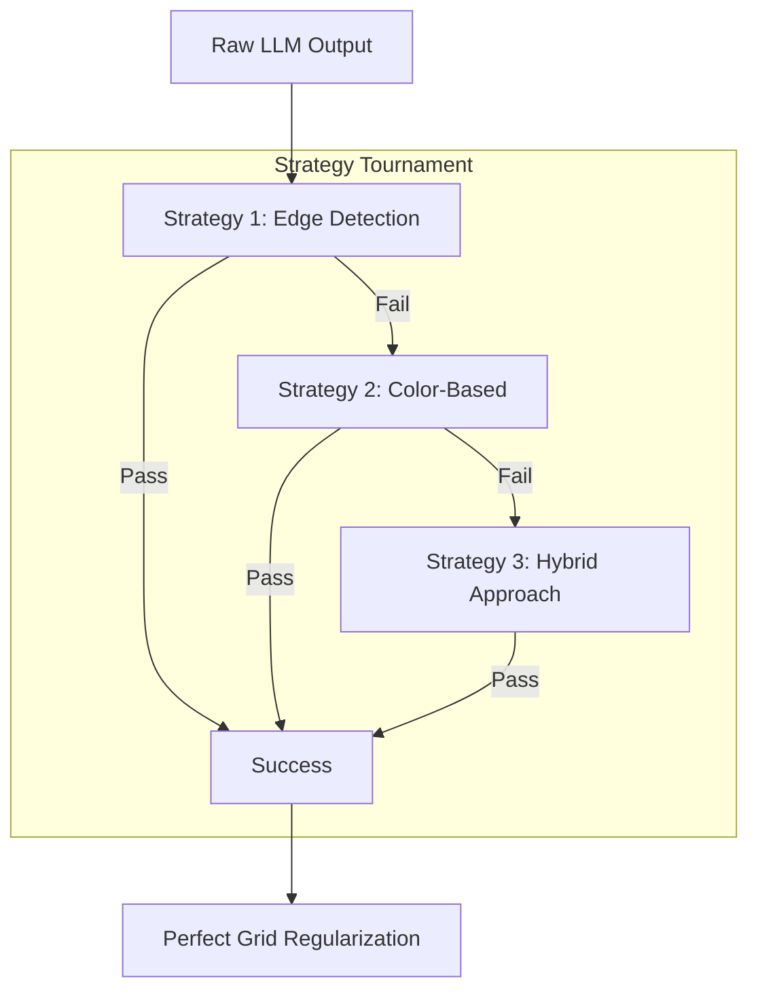

# Sprite Generation Pipeline: From Prompt to Game-Ready

This document details the advanced infrastructure that allows **Nano Banana Pro with Gemini 3** to generate game-ready spritesheets in a single pass.

## The Philosophy: "Infrastructure-First Generation"

The core insight of this pipeline is that **LLMs should focus on creativity, not formatting.**

We do not ask Gemini to "draw a perfect 32x32 grid." We ask it to "draw the character." We then use a sophisticated computer vision pipeline to enforce the grid, remove the background, and regularize the output. This allows us to use a single prompt to generate complex assets that are immediately playable.

## The "Comprehensive Processor" Architecture

The heart of the system is `tools/comprehensive_sprite_processor.js`. Unlike simple scripts that just remove a background color, this tool acts as an **autonomous agent** that competes multiple computer vision strategies against each other to find the best result.

### 1. Multi-Strategy Competition

The processor doesn't just try one way to clean the image. It runs a tournament of strategies. It attempts them in order, and the first one to pass the **Quality Gate** wins.

#### The Strategies

1.  **Edge Detection + Flood Fill**:
    - Uses Sobel operators to find sprite boundaries.
    - Applies morphological closing (Dilate/Erode) to seal gaps in the outline.
    - Flood-fills from the outside in to identify the background.
    - _Best for:_ High-contrast sprites where color bleeding is an issue.
2.  **Color-Based Removal**:
    - Samples the image edges to detect dominant background colors.
    - Performs aggressive distance-based color removal.
    - _Best for:_ Clean, solid-color backgrounds.
3.  **Hybrid Approach**:
    - Performs a light color-based removal first to clear noise.
    - Runs edge detection on the result to define shapes.
    - _Best for:_ Complex backgrounds or faint sprites.

### 2. The Quality Gate (Validation Heuristics)

How does the system know if a strategy "passed"? It runs a battery of statistical tests on the extracted sprites:

- **Density Check**: Rejects sprites that are too wispy (noise) or too solid (failed background removal). Target: 20-80% fill.
- **Variance Check**: Ensures all extracted sprites are roughly the same size. If one sprite is 10x larger than the others, the strategy failed.
- **Spatial Distribution**: Checks that sprites are spread across the image, not clumped in one corner.
- **Island Count**: Verifies that we found the `expectedTotal` number of objects.

### 3. The Anchor Strategy (Hallucination Management)

LLMs often generate "debris"—tiny particles or extra lines. We use the **Anchor Strategy** to filter this out.

1.  We identify the largest $N$ islands (where $N$ is the expected sprite count). These are the **Anchors**.
2.  Any smaller island is checked: is it close to an Anchor?
    - **Yes**: It's likely a detached hand or particle effect. **Merge it.**
    - **No**: It's hallucinated noise. **Delete it.**

### 4. Perfect Grid Regularization

Once we have clean, validated sprites, we discard the original layout entirely.

1.  **Optimal Scale**: We calculate the maximum size of any sprite in the set. We determine a scaling factor $S$ to fit that largest sprite perfectly into a 32x32 cell.
2.  **Re-Compositing**: We create a fresh, transparent canvas. We place each sprite into its mathematically correct grid cell, centered and scaled.

## The Result: One-Shot Workflow

Because this infrastructure exists, the workflow for the user is incredibly simple:

1.  **Define**: Add a character to `sprites.yaml` with a prompt.
2.  **Generate**: The LLM generates a raw image. It doesn't need to be perfect.
3.  **Process**: The pipeline cleans, extracts, validates, and regrids it.
4.  **Play**: The asset is ready for the game engine.

This turns the stochastic process of AI generation into a reliable production pipeline.
